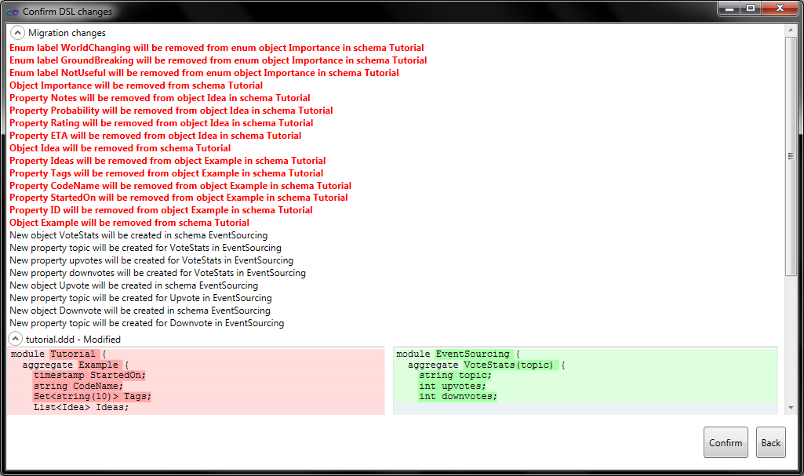
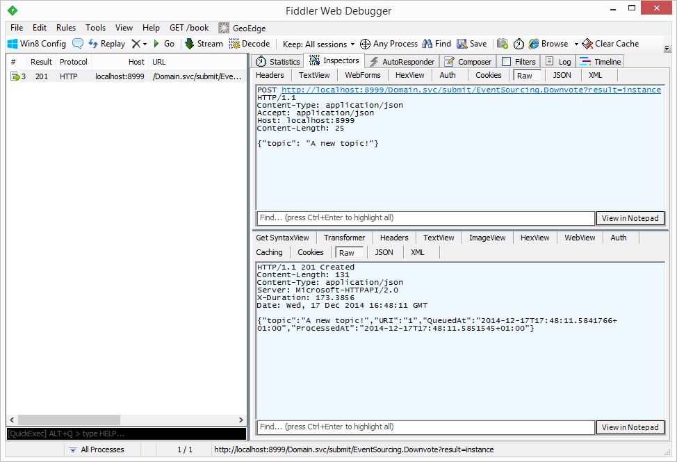
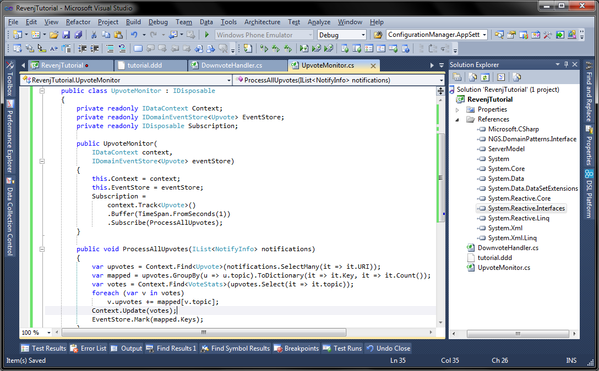

## Event sourcing usage in Revenj

[Event sourcing](http://martinfowler.com/eaaDev/EventSourcing.html) a concept where, instead of tracking the state of a system, each change is stored as an event. This allows reconstruction of the state by replaying captured events. Revenj has [support for event sourcing](https://github.com/ngs-doo/revenj/blob/master/Code/Domain/Revenj.DomainPatterns.Interface/DomainEvent.cs) with few signatures and services.

###Events in DSL

Let's write a few events and explore how they can be used in the system.

    module EventSourcing {
      aggregate VoteStats(topic) {
        string topic;
        int upvotes;
        int downvotes;
      }
      event Upvote {
        string(200) topic;
        async;
      }
      event Downvote {
        string(200) topic;
      }
    }

We'll be using this DSL as a reference model to understand the basics. This model will create three tables in the database, named: *VoteStats*, *Upvote* and *Downvote*. We will also get three .NET classes, one with `IAggregateRoot` signature and two with `IDomainEvent` signatures.

One obvious difference from other event sourcing solutions is that instead of having a single Events table with serialized versions of the object, we get a table per [Domain Event](http://martinfowler.com/eaaDev/DomainEvent.html). 
This way, there is no need for specialized projections, since tables themselves can be used for querying.

###Event sourcing basics

Let's reuse previous project to continue Revenj exploration. Overwrite the previous model with this new one, and compile. This will trigger a destructive migration:

DSL Platform has created an SQL script which is irreversible, in a sense that it will remove some objects/data. 
During development this allows for rapid domain exploration, which is supported by typesafe environment in the database. 
This way developer gets the best of both worlds: type-safety and fast prototyping.

Let's take a look at the database:

We'll find submit functions for saving events to the database along with a table and a view for each event. Views are used for querying events instead of direct table access.  
**Event sourcing is still undergoing changes and refactoring, so some things currently visible, like additional columns: *event\_id*, *queried\_at* and *processed\_at* might be changed in the future**.  
For now, every event gets a long *ID* field which is assigned during database insert. 
It's interesting to notice a [partial index](http://www.postgresql.org/docs/9.3/static/indexes-partial.html) on *processed\_at* column, which is used to quickly find unprocessed events.

`async` concept used in *Upvote* event will result in different processing patterns for those events. By default events are synchronous, which means they are processed by Revenj immediately. Asynchronous events are just stored to the database and have *processed_at* field set to *null*. This allows highly concurrent systems to process events in bulk.  
We can invoke *Upvote* processor every second, which will gather all (or subset of) unprocessed events, process them and mark them as processed. 
Domain Events can't be changed with the Revenj API, they can only be marked as processed (if they were not).

**So what does processing events even mean in Revenj?**

Except for `IDomainEvent` signature, Revenj also has event store and event handler signatures. 
They are located in domain patterns project and look something like this:

###Handling Domain Events in code

Domain Events can be submitted in bulk, which is essential in highly concurrent environments. 

#####Anatomy of an Event Handler

Event handler is just a plain class that implements a `IDomainEventHandler<T>` interface, and defines the `void Handle(T event)` method:

    public class WidgetHandler : IDomainEventHandler<Widget>
    {
        public void Handle(Widget widgetEvent) 
        {
            ...
        }
    }

To handle events, all developers have to do is write classes conforming to this signature.

#####Transactions

It's important to know that Revenj uses [transactions](http://c2.com/cgi/wiki?TransactionProcessing) by default, so if we have multiple handlers for a single event, and if any of those handlers throws an exception, entire transaction will be rolled back.  
Of course, developers can utilize other non-transactional services during processing. In case of an *async* event, processors are not called immediately, so exceptions can't be thrown. As long as the event can be successfully serialized, it is always stored to the database. For eaxample, the event defined in this model has a limit of 200 chars for *topic*. If that constraint is not satisfied, not even *async* event will not be stored to the database.

#####Setup

During startup Revenj scans all assemblies for event handler signatures (in [`EventProcessorAspects`](../Code/Domain/Revenj.DomainPatterns/Aspects/EventProcessorAspect.cs)) and registers them into the container. This way, as long as DLL is scanned during plugins initialization, various handlers will be configured without any explicit configuration or naming convention.

Revenj looks for DLLs in its plugins folder (specified in the configuration file, as described in [previous tutorial](revenj-tutorial-setup.md#starting-the-http-server)), so we need to change output path to `dependencies/Server` in order for our DLL to be picked up by during scanning process.

#####Implementation

To implement a downvote handler, we'll need to reference two assemblies: server model (created locally after each DSL compilation) and domain patterns interface project (downloaded with Revenj).

Let's use the following implementation:

    using EventSourcing;
    using Revenj.DomainPatterns;
    
    namespace RevenjTutorial1
    {
        public class DownvoteHandler : IDomainEventHandler<Downvote>
        {
            private readonly IDataContext Context;
    
            public DownvoteHandler(IDataContext context)
            {
                this.Context = context;
            }
    
            public void Handle(Downvote domainEvent)
            {
                var vote = Context.Find<VoteStats>(domainEvent.topic);
                vote.downvotes++;
                Context.Update(vote);
            }
        }
    }

Since Revenj has registered our class to the container, we can resolve various services in the constructor (`IDataContext` in this case).

#####Trying it out

Let's send a `Downvote` event:

    URL: http://localhost:8999/Domain.svc/submit/EventSourcing.Downvote?result=instance
    Content-Type: application/json
    Accept: application/json
    Body: {"topic": "A new topic!"}
    

###Events and transactions

As discussed previously, events are processed inside a transaction (using default pipeline), which means that services which are transaction-aware will have correct transaction reference. 
In the above example, requested `IDataContext` will come with `IDatabaseQuery` bound to the current transaction.

In the provided example a naive implementation of downvotes explains how to load an aggregate, change it and store it to the database. 
Some features are enabled by default, which will help with the processing of such a code. 
For example, *VoteStats* has [change tracking](https://github.com/ngs-doo/revenj/blob/master/Code/Domain/Revenj.DomainPatterns.Interface/Tracking.cs) enabled on it, so `Context.Update` will use that information to avoid another database lookup during save.

Change tracking can be disbled, which is useful in mostly-read scenarios. In that case, we can either create our own clone of the vote just after we've loaded it from the database, or let repository do another query to fetch the current version of it.

Unfortunately our simplistic example suffers from concurrency issues, which we could guard against with a lock. While this would work on a single server, it would fail in distributed environment. To work around such issues we can use locking features of the DSL Platform. In this case we could add optimistic concurrency to the VoteState, which would help with the detection of concurrent events.

Alternative aproach to event handling is reactive processing in bulk mode. This can be done by writing a service which binds to Notifications and reacts on it. A simple implementation of it would look like:

It leverages [Reactive extensions](http://msdn.microsoft.com/en-us/data/gg577609.aspx) to use Buffer on a stream, [Listen/Notify](http://www.postgresql.org/docs/9.3/static/sql-notify.html) from Postgres available through the `Track` method on `IDataContext`. 
Also, since `Mark` method is not available in the `IDataContext` (no special reason, except to keep it smallish), we need to resolve event store to mark events as processed.

Still, there are two more issues with the above code, for example, if *Upvote* monitor service is down, we will not get notifications, so in this case those votes will never be processed. 
A better implementation would look for all, or subset of unprocessed events, not just the one provided.
This can be easily done with LINQ using queries such as:

    var upvotes = Context.Query<Upvote>().Where(it => it.ProcessedAt == null);

A more [DDD](http://dddcommunity.org/learning-ddd/what_is_ddd/) aproach would be to define a [specification](http://en.wikipedia.org/wiki/Specification_pattern) *UnprocessedEvents* with the exact signature, but we'll get to that in another tutorial.

Another issue is that we are running this service outside of transactions, which means that while all upvotes will be changed in a single transaction and all events will be marked as processed in a single transaction, those will be two separate transactions. 
We will explain later on how to create units of work and share a database transaction among services.

###Processing Domain Events

We also didn't touch the notion of event replay-ability, but will do that in the next [tutorial](revenj-tutorial-aggregate-events.md). 
For now, let's finish up with sending some events to the server with Fiddler. 
REST API for events is available by default in `DomainCommands.cs` from the plugins rest commands project. 
If we look at the signature and the implementation, we will see a reoccurring pattern. 
Service signature:

    [WebInvoke(Method="POST", UriTemplate="/submit/{domainEvent}?result={result}")]
    Stream SubmitEvent(string domainEvent, string result, Stream body);

translates the url to correct domain event type, deserializes it from provided POST body using specified Content-Type header (or as XML by default) and sends it down to the plugin server command: `SubmitEvent`.

`SubmitEvent` is similar as previous command in a sense that it's a generic command which does basic validations, permission checks and just pass it to the appropriate service - in this case `IDomainEventStore`, which looks like:

    public interface IDomainEventStore
    {
      string Submit<TEvent>(TEvent domainEvent)
            where TEvent : IDomainEvent;
    }

Event store will invoke processors (for synchronous events) and persist it to the database.

REST service also accepts an argument of the expected result, which can be identity of the event (URI) or the whole instance. 
While events are immutable after they hit the database (in a sense that we can't modify it), they are mutable before, which allows for some nice features.

###Getting the most of Domain Events

For example let's model an aggregate root with a [surrogate key](http://en.wikipedia.org/wiki/Surrogate_key) which is applied just before insert to the database and an event for creating such aggregates.

    module EventSourcing {
      aggregate Customer(id) {
        int id { sequence; }
        string name;
      }
      event NewCustomer {
        string name;
        int? id;
      }
    }

We have extended module *EventSourcing* with a new aggregate root which has primary key integer id created from a database sequence just before insert. 
Basic idea is to send an event *NewCustomer* from the outside, create a customer in the handler and update the event with the correct id. 
Now we can return the whole NewCustomer event to the caller which he can inspect. 
Various other changes can be done in the process, for example we could remove special characters from the name shorten it or do some other domain logic to it. 
So let's compile DSL to get all the boilerplate and add our own domain logic on top of it. 
End result should look something like this:

where we create a customer in the event handler and mutate the event to set the value of a new id. 
We can also show how to write extension methods on top of generated classes. 
There are several ways to extend the behavior of automatically maintained model and this is one of them (ignore for now that it would be much easier just to sanitize name within the handler, the main point is that we now have SanitizeName method on top of *Customer* class created from the model).
Let's send some event down the write and see how it behaves:

In the http response we can see that the event has been populated by the server with several fields, but most importantly with id field for the identity of the new customer. 
If we do a lookup for the customer by the provided identity we get a sanitized newly created customer:

*If you have issues with id not being assigned/customer not being created, it's probably due to event handler not being picked up during initialization. 
This usually happens because DLL was not in the correct folder, so check the output folder for the project that it goes to the dependencies/Server folder (to keep it simple for now).*