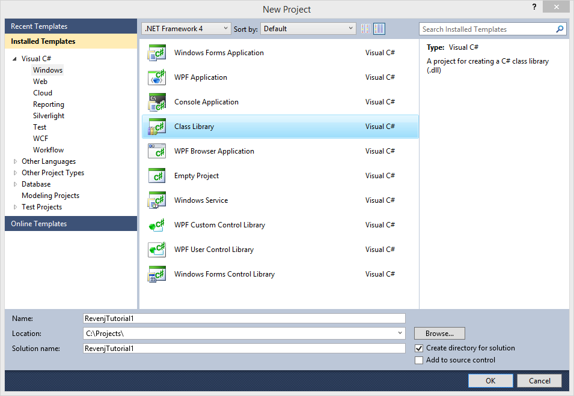
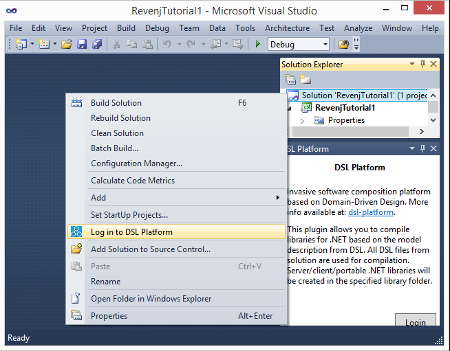
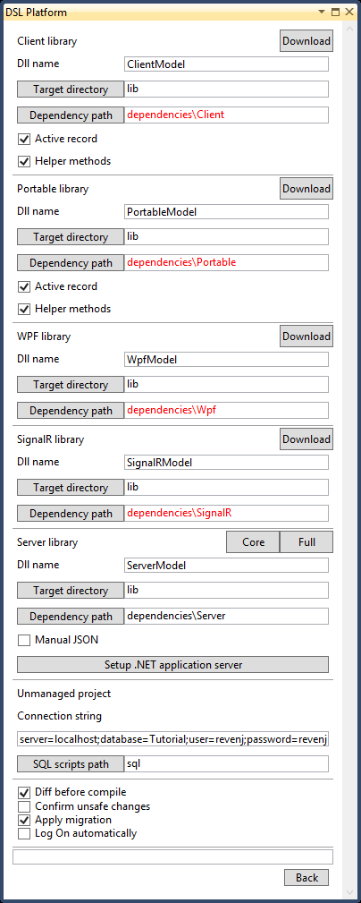
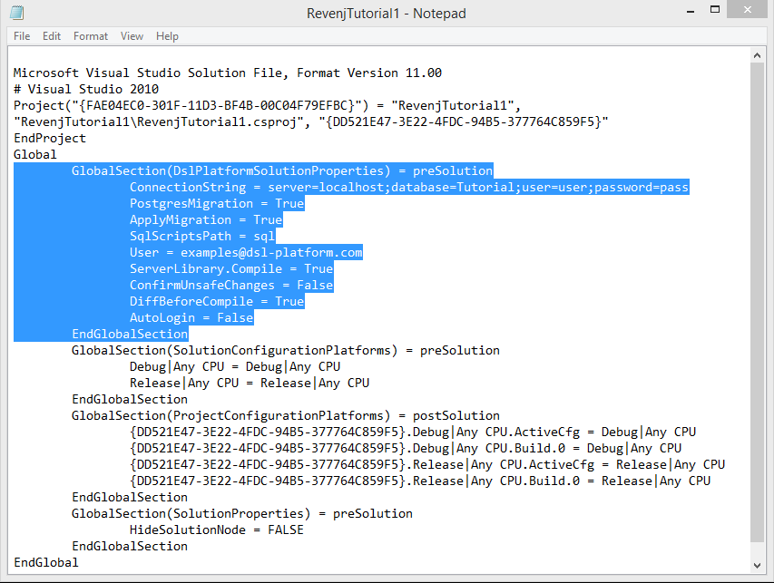
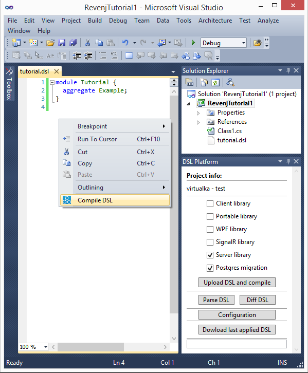
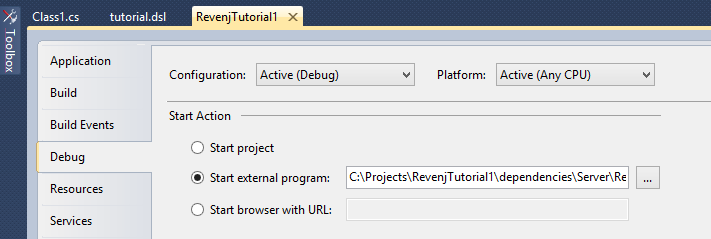
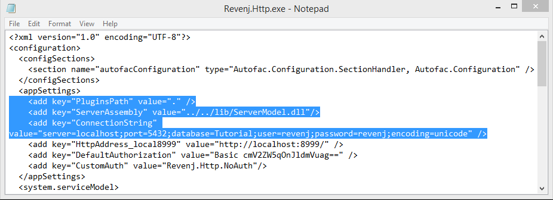
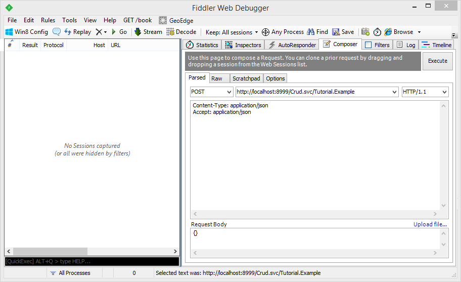
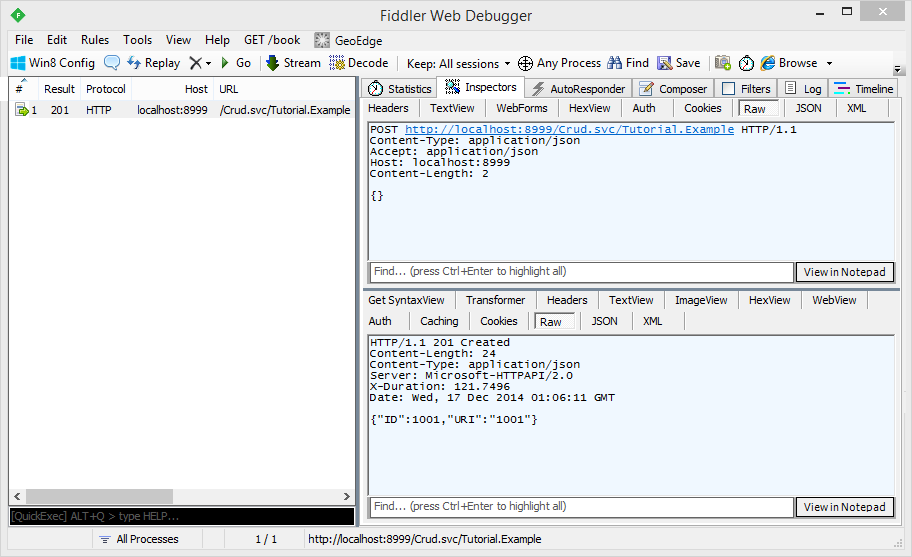
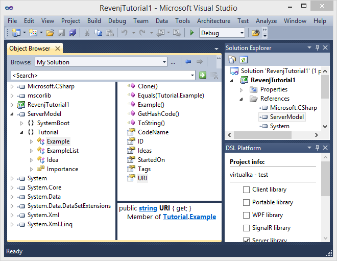

## Revenj tutorial with .NET, Postgres and Visual studio

**Revenj** is a framework for .NET and Mono with support for Postgres and Oracle databases.
While it can be used as any other framework, it's rather small (feature-wise) and it's best used as a backend for [DSL Platform](https://dsl-platform.com).
This makes it an ideal [REST service](http://c2.com/cgi/wiki?RestArchitecturalStyle) built against [DSL](http://c2.com/cgi/wiki?DomainSpecificLanguage) models, or within some other framework such as ASP.NET.

- Revenj contains [LINQ](http://msdn.microsoft.com/en-us/library/bb397926.aspx) providers for Postgres and Oracle, which are somewhat different from other LINQ providers since they leverage object-oriented features of those databases. This allows storing [NoSQL documents](http://en.wikipedia.org/wiki/Document-oriented_database) inside relational databases.
- Revenj also supports various serializations out of the box, such as: Json, Protobuf and XML.
- Inversion of control is used to bind various services together and Autofac (slightly modified) is the default container.
- Advanced features such as [AOP](http://docs.castleproject.org/Windsor.Introduction-to-AOP-With-Castle.ashx) are supported, which means aspects can be registered to utilize various inspections and fixes, without providing alternative service implementations.
- Plugin-based architecture allows for easy extensions without code changes or recompilations. Revenj uses signature based extensions which means that services are picked up by their signature, not by their name or explicit wiring. There is no need for any configuration.

In this tutorial we will use it as a REST service to show off why Revenj/DSL Platform is useful.

DSL Platform is a compiler for DSL files which converts the provided DSL model into target code and SQL. It is available for free as an online service, or can be licensed for offline installation.

###Getting started

To get started, we'll need a DSL Platform account, Postgres (9.1 or newer), a DDD plugin for Visual Studio and .NET (4.0 or newer)/Mono (3.2 or newer).

#####DSL Platform account
Go to the [Platform registration page](https://dsl-platform.com/register), and complete the registration process. We will use this account to manage and compile our DSL files.

#####Postgres
This tutorial assumes we have Postgres 9.1 or newer installed, along with an empty database.
Connection string used in this tutorial (although any values can be used):

    Hostname: localhost
    Port:     5432
    DB Name:  Tutorial
    Username: revenj
    Password: revenj

To create the `revenj` user and `Tutorial` database, you can run the following two commands:

    createuser -DIPRSUpostgres revenj
      Enter password for new role: revenj
      Enter it again: revenj
    createdb -Upostgres -Orevenj -Eutf8 -Ttemplate1 Tutorial

#####Visual Studio plugin
For this tutorial we'll be assuming usage of [DDD for DSL](http://visualstudiogallery.msdn.microsoft.com/5b8a140c-5c84-40fc-a551-b255ba7676f4) Visual studio plugin. Alternatively, same actions could be performed via a [command-line client](https://github.com/ngs-doo/dsl-compiler-client).

###DSL introduction

We will start with a minimal DSL as en example, along with a simple [CRUD](http://en.wikipedia.org/wiki/Create,_read,_update_and_delete) operation to get a feeling of what's happening.

Minimal useful DSL that we can write is:

    module Tutorial {
      aggregate Example;
    }

However, there is some syntax sugar magic going on here. It is equivalent to the desugared version:

    module Tutorial {
      aggregate Example(ID) {
        int ID { sequence; }
      }
    }

Module *Tutorial* with [aggregate root](http://dddcommunity.org/resources/ddd_terms/) *Example* will be mapped to:
  * namespace *Tutorial* with class *Example* in C#
  * schema *Tutorial* with table *Example* in Postgres

The *sequence* concept indicates that the *ID* field will be an auto-incremented value provided by the database.

To CRUD it we can use the [REST-like API](https://github.com/ngs-doo/revenj/blob/master/Code/Plugins/Revenj.Plugins.Rest.Commands/ICrudCommands.cs) available in a plugin DLL provided with Revenj.  
Rest plugin is using a WCF signature for defining the endpoint and is available (by default) via `/Crud.svc/Tutorial.Example` url on port `8999`.

###Configuring DSL Platform plugin

In Visual Studio, create a new **Class Library** project for .NET 4 or newer:

Now we can right click on the solution to pull up its properties, and select the **Log in to DSL Platform** option.

Next, we need to download and configure dependencies.  
Revenj server can be downloaded from [GitHub](https://github.com/ngs-doo/revenj/releases/latest) or NuGet, but the easiest way is to download it through the plugin configuration window (section *Server library*, button *Full*).

Let's also enable *Apply migration* (in configuration window) option so that we don't need to manually run SQL script against the database. In order to see generated SQL scripts, we need to specify a folder for them. Create a folder `sql` inside our solution and type in `sql` in *SQL scripts path*.

Also, check the *Postgres migration* checkbox in the main plugin window.

Finally, we need to create a folder `lib` in our solution, where our compiler library will be located.

Our configuration window should now look something like this:

Let's take a look at the solution file to see what's going on:

The Platform-specific section (`DslPlatformSolutionProperties`) is highlighted.

###Compiling the DSL
With everything configured, we can write our first DSL. Let's start by adding a new text file named `tutorial.dsl` and paste in the DSL.  
We should have something like this:

Compilation can be invoked by clicking the *Upload DSL and compile* button, or by choosing the *Compile DSL* item in context menu of DSL editor.
After saving the *dsl* file and starting the compilation, we will see a diff screen (since *Diff before compile* option is enabled):

The diff explains what changes will be applied to the database.  
After confirmation, the database should be upgraded which we can check in [PgAdmin](http://www.pgadmin.org/):

DB script which was used to migrate the database can be found in the `lib` folder. It should look something like this:

Comments of database changes are at the top, followed by a check if database upgrade is allowed.
Next is the migration script that will perform migration from the previous state to the current state.
Since this was our initial migration, a helper `-NGS-` schema will be created, which is used for storing the previous version of applied DSL and some system functions.

###Starting the http server

To start the Revenj Http server, we need to specify it as an external program in the project configuration under *Debug* tab. The external program path should point to the `Revenj.Http.exe` downloaded to dependencies/Server folder:

The last thing we need to do is to change the Revenj's config file: point it to our lib folder and adjust the connection string.

Now we can run our project, which will start Revenj server using our customized library.

Let's try if it works with [Fiddler](http://www.telerik.com/download/fiddler).
By default, security is disabled (`<add key="CustomAuth" value="Revenj.Http.NoAuth"/>`) in the config file, so we can create a new `Example` by sending a POST request to Revenj:

    URL:          http://localhost:8999/Crud.svc/Tutorial.Example
    Content-Type: application/json
    Accept:       application/json
    Request Body: {}

If everything is working, we should get a response from the server:

###First tour through Revenj

**So how was this processed by Revenj?**

POST request came to the `Crud.svc/Tutorial.Example` url.
This is handled by the `ICrudCommands.cs` service contract in REST commands plugin:

During initialization, Revenj Http looked up all WCF service contracts and initialized them. Revenj Http is actually using .NET HttpListener, but it's passing its requests to matched WCF service contracts, in this case `Crud.svc` Create method.

Its implementation `CrudCommands.cs` is just passing it through the Revenj pipeline to the underlying Create class in `Revenj.Plugins.Server.Commands` project, which:

 - performs basic validations
 - checks caller permissions
 - deserializes object (or casts is from previously deserialized one) to correct type
 - calls insert on repository with it
 - and returns it to the caller in requested format

This is the basic architecture of processing requests in Revenj.
While a couple of interesting things happen in the pipeline, we will not discuss them in this tutorial.

###Modeling NoSQL documents

Now that we have a working setup and understand the basic processing of the request, let's write a more interesting model (which cannot be expressed as a standard [ERM](http://en.wikipedia.org/wiki/Entity%E2%80%93relationship_model)):

    module Tutorial {
      aggregate Example {
        timestamp StartedOn;
        string CodeName;
        Set<string(10)> Tags;
        List<Idea> Ideas;
        persistence { history; }
      }
      value Idea {
        date? ETA;
        Importance Rating;
        decimal Probability;
        string[] Notes;
      }
      enum Importance {
        NotUseful;
        GroundBreaking;
        WorldChanging;
      }
      snowflake<Example> ExampleList {
        StartedOn;
        CodeName;
        order by StartedOn desc;
      }
    }

This model shows-off various minor and major DSL features. See here for detailed explanation.

DSL supports various property types, collections, references and basically everything you need to describe a complex domain, while DSL Platform will provide best-practice implementations for such concepts. The DSL described above will result in a model which would otherwise have to be manually coded by the developer, along with a lot of boilerplate such as: repositories, conversions from C# objects to Postgres objects, various validations, serialization code, various other libraries, Clone and Equals methods, etc...

If compile the new DSL, and add a project reference to the generated `ServerModel.dll` (in the `lib` folder), we will see something like:

Repositories and various other services are marked as [*internal*](http://msdn.microsoft.com/en-us/library/7c5ka91b.aspx), but are available through Revenj interfaces.
So *ExampleList* repository can be resolved as `IQueryableRepository<ExampleList>` or by using `IDataContext` with its `Query<ExampleList>()` method.
If for some reason custom repository needs to be used, it can be registered in the container. This will override the default registration.

It's interesting to take a look at the database to see the model.
Advanced object-oriented features of Postgres are utilized for some aspects of the model, such as `Set`, `List` and `value object`:

If you look at the database you will find a `varchar(10)` collection named *Tags*, collection of types named *Ideas*, history table (matching exact structure of Example table), and a `persist_Example` function which accepts arrays as arguments and is optimized for bulk processing. If necessary, optimized single insert/update function can be created in the database and called from the repository.  
Tables aren't accessed directly, but through views. If required, [DBA](http://en.wikipedia.org/wiki/Database_administrator) can manually alter objects created by the Platform. Of course, when everything else fails, dropping down to SQL is possible through DSL.

###Conclusion

While some [ORM](http://en.wikipedia.org/wiki/Object-relational_mapping)s can support simple NoSQL models, none are close to supporting advanced in-database NoSQL-like modelling, as provided by Platform and utilized by Revenj.
Of course, developers aren't forced to use object oriented features, collections and various other non-relational constructs, but since those can provide various optimizations they are often useful.

Basic premise behind DSL is to have a ubiquitous language not only in the core domain, but everywhere.  
This greatly improves communication between various developers and if they utilize correct domain terminology, even the domain experts can validate model by reading the DSL - a formal documentation.

Let's look at few examples of how the Plaform helps with minimizing boilerplate code:
  * Aggregate root has a `Set<string(10)>` field.
  * Since neither the field, nor the content of the field are optional, generated code will check for nulls.
  * Since we are using a `string(10)` type, generated code will guard against tags longer than 10 chars.
  * All those checks improve the quality of our data, but are often cumbersome to write.

**But what about some advanced features available as a single DSL line, such as the history concept?**

This concept is translated to various objects in the database, snippets of code during persist, casts between representations, specialized services in the code, basically various boilerplate one would need to write/specify to get such a complex feature. It's further complicated by the fact that history objects are typesafe in the database.

If we just stored the object as JSON or something similar in a field, it would introduce problems down the line when we tried to change the model.
Goal of the DSL Platform is to help you write code which will not turn into legacy.
To be able to do that, DSL Platform maintains typesafe models everywhere.

If domain is explored during lifetime of the application, deeper insights should happen.
They result in fields being moved around, renames, nullability changes and various other small and big changes.
To keep up with that, [automatic migrations](https://docs.dsl-platform.com/dsl-migrations) keep model in sync with the database and typesafe compilers warn about hand written code on top of recreated DSL model.

Regarding the history feature, from the developer point of view, he will just use an `IRepository<IHistory<Example>>`, while the compilers will take care of all the boring work.
